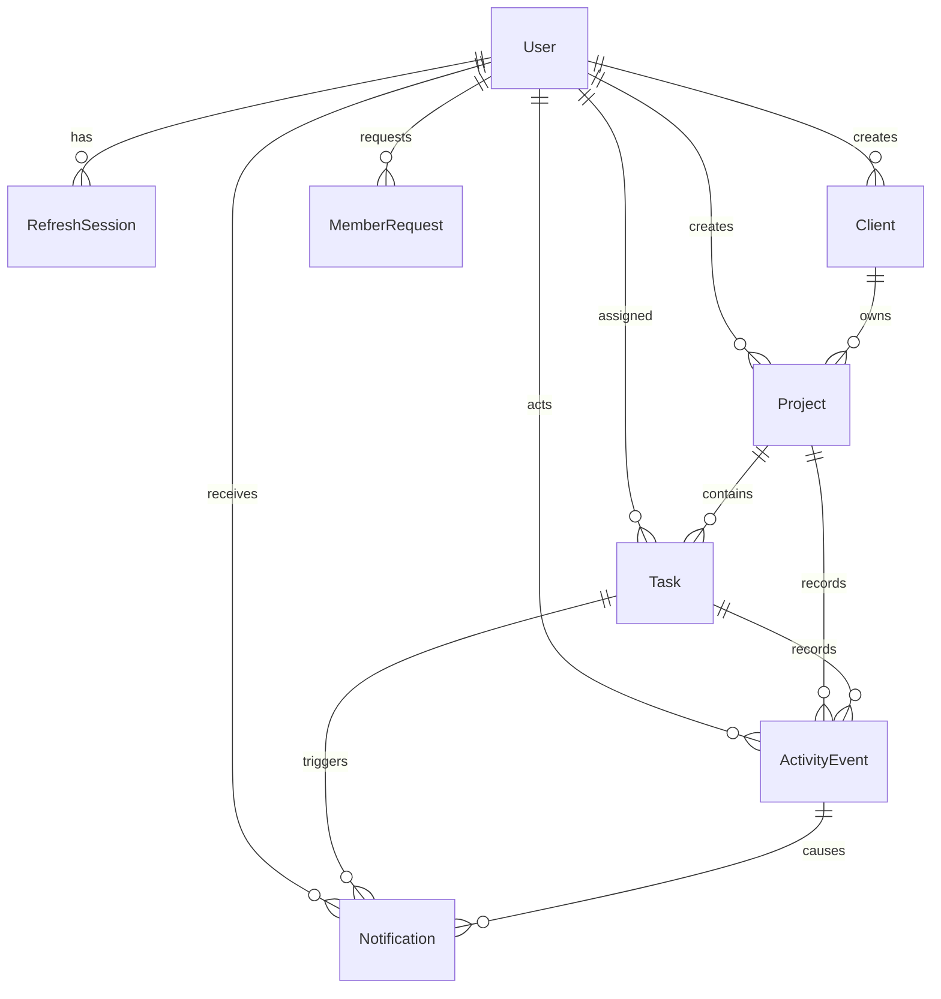

# Velozity Project Desk

A full-stack internal project operations dashboard for Admins, Project Managers, and Developers. The React frontend uses a compact brutalist interface; the Express API owns authentication, authorization, project/task rules, durable activity, notifications, presence, and overdue processing.

## Current implementation status

The application is connected end to end. The React dashboards read and mutate the Express API, restore sessions through the HttpOnly refresh cookie, enforce forced password changes, keep access tokens in memory, and connect through Socket.IO using WebSocket transport only. Admin, Project Manager, and Developer navigation and data are role-specific; task filters are reflected in shareable URL query parameters.

The backend includes the complete Prisma schema and migration, repeatable Neon seed, role/ownership-scoped REST routes, JWT access tokens, rotated database-backed refresh sessions, Argon2id passwords, durable activity catch-up, notifications, presence, and a node-cron overdue worker. The Neon-backed mutation path and role-filtered WebSocket delivery have been exercised end to end with the seeded Developer and Project Manager accounts.

## Local setup with Neon

Requirements: Node.js 24+, pnpm 11.24+, and a Neon PostgreSQL project.

1. Copy `.env.example` to `.env` (a placeholder `.env` already exists locally).
2. In `.env`, paste Neon's **pooled** connection string into `DATABASE_URL` and its **direct/non-pooler** connection string into `DIRECT_URL`.
3. Replace `JWT_ACCESS_SECRET` and all seed passwords. Never commit `.env`.
4. Set `FRONTEND_ORIGINS` to a comma-separated list of exact local/deployed frontend origins. Local ports 5173 and 5174 are included by default; replace the Vercel placeholder with the real HTTPS URL.
5. Install and initialize:

```bash
pnpm install
pnpm db:generate
pnpm db:migrate
pnpm db:seed
pnpm dev
```

Frontend: `http://127.0.0.1:5173`. API: `http://127.0.0.1:4000/api/v1`. Readiness: `/api/v1/health/ready`.

Useful verification commands:

```bash
pnpm typecheck
pnpm test
pnpm build
```

These commands currently pass for every workspace package. A Neon-backed smoke test also verified Developer login, assigned-task isolation, optimistic task status mutation, delivery of the activity event to the Developer, delivery of the notification signal to the owning PM, and restoration of the test task.

The seed is repeatable and uses stable identifiers/upserts. It never truncates the database. It creates exactly 1 Admin, 2 Project Managers, 4 Developers, 3 clients, 3 projects, 15 tasks (5 per project), multiple stored activity events, example notifications, and at least 2 already-overdue tasks. Demo emails are `anika@velozity.dev`, `maya@velozity.dev`, `rohan@velozity.dev`, `aarav@velozity.dev`, `ishita@velozity.dev`, `noah@velozity.dev`, and `kabir@velozity.dev`; their passwords come only from the `SEED_*_PASSWORD` environment variables.

## Authentication and authorization

- `POST /auth/login` rate-limits attempts, verifies an active user and Argon2id hash, returns a 15-minute signed access JWT, and sets a random refresh token in an HttpOnly cookie.
- Only a SHA-256 digest of a refresh token is stored. `POST /auth/refresh` atomically consumes and rotates it. Reuse revokes the entire token family.
- Access JWTs include identity and session ID, but the API reloads the current database role, active state, and session status on every protected request. It never trusts a client-supplied role.
- Refresh/logout use approved-origin and double-submit CSRF checks. Tokens are never placed in URLs or localStorage.
- Role changes, deactivation, and Admin password resets revoke sessions and disconnect affected sockets.
- Protected queries include the role scope in Prisma: PMs use `createdById`, Developers use `assignedDeveloperId`. Out-of-scope IDs return 404.
- Admin-created temporary credentials set `mustChangePassword`; users complete the flow through `POST /auth/change-password`.

## Database design



UUIDs are used for application entities. `ActivityEvent.sequence` is an auto-incrementing bigint replay cursor; task numbers are independent human-readable integers. Foreign keys restrict destructive deletion, while clients/projects are archived and users are deactivated to preserve audit history.

Key indexes and their query purpose:

| Index | Purpose |
| --- | --- |
| `User(email)` unique | Login and duplicate account prevention |
| `Project(createdById, archivedAt, createdAt)` | PM-owned project lists and dashboard counts |
| `Task(projectId, status, dueAt)` | Project/status/date filtering |
| `Task(assignedDeveloperId, priority, dueAt, id)` | Developer isolation and stable priority/deadline ordering |
| `Task(projectId, priority, dueAt)` | PM priority summaries |
| Partial `Task(dueAt)` where unfinished/not overdue | Small scheduled overdue scan |
| `ActivityEvent(projectId, sequence)` and `(taskId, sequence)` | Authorized feed replay and task history |
| `Notification(recipientId, readAt, createdAt)` | Inbox paging and unread count |
| Unique notification recipient/event/type | Retry-safe notification creation |
| Refresh token hash unique plus user/family/expiry indexes | Rotation, family revocation, and cleanup |

## API surface

All routes are under `/api/v1`. Success responses use `{ "data": ..., "meta"?: ... }`; failures use `{ "error": { "code", "message", "fieldErrors"?, "requestId" } }`. Validation errors are 400, unauthenticated requests 401, forbidden roles 403, hidden/out-of-scope resources 404, stale versions 409, and login throttling 429. Stack traces are never returned.

| Routes | Access |
| --- | --- |
| `/auth/csrf`, `/auth/login`, `/auth/refresh`, `/auth/logout`, `/auth/me`, `/auth/change-password` | Session lifecycle |
| `GET/POST /users`, `PATCH /users/:id` | Admin |
| `GET/POST/PATCH /clients` | Admin |
| `/lookups/developers`, `/lookups/clients` | Admin and PM, safe fields only |
| `GET/POST/PATCH /projects` | Admin global, PM own projects |
| `GET/POST /projects/:id/tasks` | Scoped list; Admin/owning PM create |
| `GET/PATCH /tasks`, `PATCH /tasks/:id/status`, `/tasks/:id/activity` | Role-scoped |
| `/activity?after=&through=&before=&limit=20` | Database-backed role-scoped replay |
| `/notifications`, `/notifications/:id/read`, `/notifications/read-all` | Current user only |
| `/dashboard` | Role-specific aggregates |
| `/member-requests` | PM request; Admin approve/reject with temporary password |

Every task list filters in PostgreSQL through `status`, `priority`, `dueFrom`, `dueTo`, and optional `projectId`. Date bounds are interpreted as Asia/Kolkata days, page size is capped at 100, inverted ranges are rejected, and ordering is Critical → High → Medium → Low, then due date and ID. Mutations use `expectedVersion`; stale writes return `VERSION_CONFLICT`.

## Realtime, activity, and notifications

Socket.IO was selected because it supplies authenticated handshakes, acknowledgements, rooms, reconnection support, and a well-tested TypeScript client while still being configured with `transports: ['websocket']` and no polling fallback.

The server joins only server-controlled user/Admin rooms. Project subscription requests are reauthorized against Prisma. A committed event is delivered to Admins, the owning PM, the current assignee, and authorized project viewers. Developers never join broad project rooms. Reassignment emits `task.access-revoked` to the former assignee.

Every activity event is inserted in the same database transaction as its task change, then emitted only after commit. A shared PostgreSQL advisory transaction lock gives event-producing writes a commit-ordered bigint cursor. On initial load/reconnect, the client establishes its socket, obtains `feed.watermark`, and calls `/activity` for the latest 20 currently authorized missed events. Event IDs provide deduplication across replay and the buffered live stream. PostgreSQL remains authoritative across process restarts.

Assignment and In Review notifications are stored transactionally. Socket event `notifications.changed` tells only the recipient to refetch the authoritative inbox/count. Mark-all accepts a server timestamp watermark so newly arrived notifications remain unread.

Presence counts distinct authenticated users, not sockets, and is broadcast only to Admins. The baseline intentionally runs one API instance.

## Overdue job

`node-cron` runs every minute in the persistent API process and also reconciles once at startup. It finds unfinished tasks on active projects whose deadline has passed, conditionally marks them in bounded batches, stores a system activity event, and emits after commit. The conditional update makes repeated ticks idempotent. Completing a task or moving its deadline into the future clears the overdue flag. Expected marking delay is approximately one minute while the worker is healthy.

Node-cron is appropriate for this small, single-instance assessment because the job is short, idempotent, and does not yet require Redis/Bull infrastructure.

## Architecture

Express was chosen for its small middleware surface and direct integration with the single HTTP/Socket.IO server. Controllers/routes translate HTTP only; services own permissions and transactions; Prisma owns database access; reusable policy builders apply the same role scopes to lists, detail, history, dashboards, and live recipients. Application code is TypeScript throughout.

The deployment uses the Vercel React frontend plus one persistent Node container for Express, Socket.IO, and node-cron, backed by Neon PostgreSQL. The instructions below connect Vercel directly to Render; a same-origin Vercel `/api` proxy can be added later if browser third-party-cookie restrictions interfere with refresh sessions.

## Render deployment

The repository includes `render.yaml` for a Docker deployment. The important monorepo detail is that the Docker build context must be the repository root: the backend depends on the root pnpm lock/workspace files and `packages/contracts`.

For an existing Render web service, use these **Build & Deploy** settings:

- Root Directory: leave blank
- Language/Runtime: Docker
- Dockerfile Path: `./backend/Dockerfile`
- Docker Build Context Directory: `.`
- Health Check Path: `/api/v1/health/ready`

Set `DATABASE_URL`, `DIRECT_URL`, and `JWT_ACCESS_SECRET` as secret environment variables. Set `FRONTEND_ORIGIN=https://velozity-frontend-iota.vercel.app`, and keep that URL plus the required local 5173/5174 origins in `FRONTEND_ORIGINS`. Because the frontend and API are currently on different HTTPS sites, use `COOKIE_SECURE=true` and `COOKIE_SAME_SITE=none`. The Docker start command runs the committed Prisma migrations before starting the API, so this works on Render's Free plan without its paid pre-deploy feature.

After Render supplies the backend URL, set this Vercel project environment variable and redeploy the frontend:

```text
VITE_API_URL=https://YOUR-RENDER-SERVICE.onrender.com/api/v1
```

Verify the deployment at `https://YOUR-RENDER-SERVICE.onrender.com/api/v1/health/ready`, then log in through the Vercel frontend and test a member creation/request.

The repository-level `vercel.json` rewrites application routes to `index.html`, so refreshing `/admin`, `/pm/tasks`, or `/developer/activity` does not produce a Vercel 404. `VITE_API_URL` is a public build-time configuration value, not a secret; set it as a Vercel **Config** value rather than storing it in the backend `.env`.

## Assessment explanation (198 words)

The hardest part was making real-time updates obey exactly the same permissions as normal API requests. It is easy to broadcast every task event to every connected browser, but that would expose project and developer data across roles. I made PostgreSQL the source of truth and store each activity event in the same transaction as the task change. Only after that transaction commits does the server publish the event. Socket.IO authenticates the connection with the short-lived access token, reloads the database-backed session, and places users only in server-controlled rooms. Admins receive the global stream, Project Managers receive events from projects they own, and Developers receive events only for tasks currently assigned to them. Reassignment also removes the former developer's live access.

Reconnect handling was another important detail. The client first asks the socket server for an authorized database watermark, then fetches the latest 20 visible events from PostgreSQL and deduplicates them with buffered live events. This avoids relying on process memory and keeps recovery correct after a restart. I chose Socket.IO for authenticated handshakes, rooms, acknowledgements, and reconnect support, while forcing WebSocket transport so there is no polling fallback.

With more time, I would add Playwright tests running three simultaneous browser contexts against an isolated PostgreSQL database, plus a transactional outbox and Redis adapter for reliable multi-instance delivery.

## Known limitations

- Presence and Socket.IO rooms assume one API instance. Horizontal scaling needs shared coordination.
- The commit-then-emit window has no transactional outbox; reconnect replay recovers durable events after a process crash.
- Reconnect automatically returns the newest 20 missed items; older authorized history remains available through cursor pagination.
- Overdue processing requires an awake persistent server and can lag by approximately one minute.
- There is no email delivery or password-reset email flow; Admins issue temporary passwords.
- The automated suites cover frontend API behavior and backend security primitives; the Neon-backed multi-role API/WebSocket path is currently a smoke test rather than a committed isolated-database test suite.
